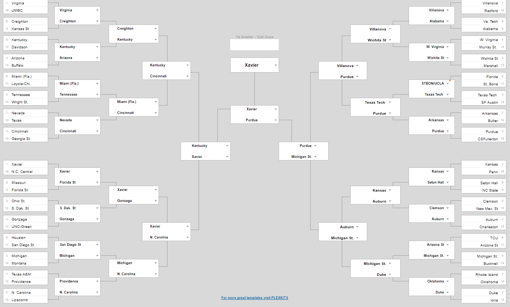

# bot__wan's 2018 NCAA bracket 

Me and Crystal trained an ensemble method on all of the 2018 season, across all teams, to predict winners of the NCAA Men's Basketball Tournament this year. We streamed this live and you can view the broadcast on our [Twitch channel (**video here**)](https://www.twitch.tv/videos/238511605)  
## A few crappy things in the data  
So the datasets are split -- one is a full one but has errors, and the other is the supplement. Didn't have too much time in-stream to go back and merge these two sets, but the notebook will do that for you in the top cells.  

In one of the middle cells, I use pd.read_clipboard(). That is coming from this page: https://www.sports-reference.com/cbb/seasons/2018-school-stats.html 
I would recommend you to use the "modify/share" feature, then click "comma delimited" and copy that frame. This is what I used in stream.  

## A few crappy things in the notebook  
It's obviously very disorganized, so I would recommend watching the video back for clarifications on what is what. Also, the model isn't tuned at all -- it's straight out of the box. So I would probably recommend playing around with some of the gradient boosted parameters for better results.  

Something we didn't get to in the stream was making it a regressor. I would maybe try that.  

Also, we chose a handful of features that predicted outcome, but you can see that we have maybe overfit on things like rebounding and underfit things like 3PT. Try playing around with the data and the notebook to see if you can get a better, more accurate bracket than us!  
## Why we're doing any of this at all  
We are actually donating all revenue from this stream to [DonorsChoose.org](donorschoose.org), on behalf of @bot__wan (aka my stream, me, and Crystal) and Neuroscience Twitter (with special shout outs to Dr. Bethann McLaughlin at Vanderbilt who helped put this all together). We are participating in a crowdfunding event called [#DarwinsBalls](https://twitter.com/hashtag/darwinsballs) where we pay a $10 (minimum) donation to a [DonorsChoose](donorschoose.org) classroom in order to enter the bracket competition. With the donations from this stream, we'll be putting that towards a DonorsChoose project (we'll let you know which one in stream) and me and Crystal will both also be contributing to other projects. 

## Shoutouts  
Follow me and Crystal's bot, [@bot__wan](twitter.com/bot__wan) on twitter  
Follow [Crystal](twitter.com/boozybrain) and [me](twitter.com/nickwan) on twitter   
Follow me on [Twitch -- streams every Tuesday and Thursday](twitch.tv/realnickwan)  
